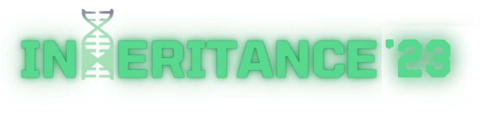

<h1 align="center">
  
   
  STOCK-MARKET-GAME
</h1>

   <strong>Stock-Market-Game</strong> - One Sentence Description of your project 
  CoC Inheritance 2023 || InfoSHAHs    
  Add any <a href="https://shields.io/">Shields</a> here

Table of Contents

- [Description](#description)
- [Links](#links)
- [Tech Stack](#tech-stack)
- [Progress](#progress)
- [Future Scope](#future-scope)
- [Applications](#applications)
- [Project Setup](#project-setup)
- [Usage](#usage)
- [Team Members](#team-members)
- [Mentors](#mentors)
- [Screenshots](#screenshots)

## 📝Description
  <table>
  <tr>
    <td>
Embark on our Stock Market Game with an added edge – featuring news headlines and change in stock prices empowering you to make informed investment decisions based on market sentiment trends.
  
      The <strong>Stock-Market-Game</strong> consists of:
      <ul>
<li> <b>10</b> Sectors
<li> <b>50</b> Stocks
<li> <b>100+</b> Real Time News Headlines
<li> Invest Smart, Play Smarter
      </ul>
    </td>
  </tr>
  </table>

  ## 🔗Links

### Frontend
- [**Stock-Market-Game**]()📈

### Assets
- [GitHub Repo](https://github.com/kshitijdshah99/Inheritance-Stock_Market_Game)

### Backend
- [Stock_Market_Game Server](Add Link Here)
- [Stock_Market_Game Model Deployment](Add Link Here)

## 🤖Tech-Stack

<a href="postman">
<a href="fastapi">
## 📈Progress

- [x] 
- [x] 
- [x] 
- [x] 
- [x] 
- [x] 
- [x] 
- [x]
- [x] 
- [x] 
- [x] 
- [x] 

## 👩‍💻Team members

- [**P**ratham Shah](https://github.com/prathamcoders) - pratham.shah.ps000@gmail.com
- [**L**abdhi Shah](https://github.com/) - @gmail.com
- [**V**atsal Shah](https://github.com/VSCODER00) - @gmail.com
- [**K**shitij Shah](https://github.com/kshitijdshah99) - kshitij.d.shah.999@gmail.com

## 👨‍🏫Mentors

- [Shaurya Swarup](https://github.com/)
- [Dhruv Sapra](https://github.com/)

